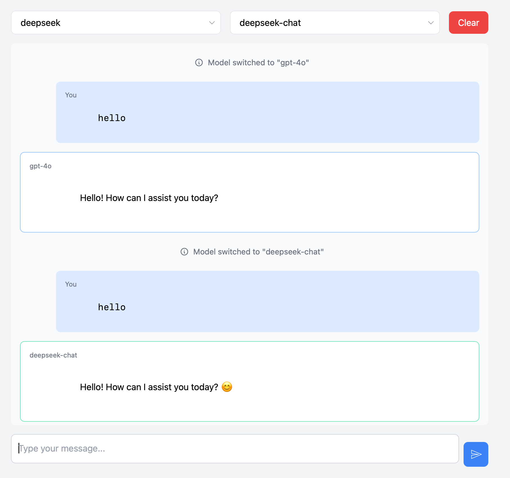

# LLM Picker: Multi-Provider AI Chat Interface

## Overview

LLM Picker is a flexible, multi-provider chat interface that allows users to interact with various Large Language Models (LLMs) from different providers such as OpenAI, Anthropic, Google Gemini, AWS Bedrock, Groq, and more.

 <!-- You'll want to add an actual screenshot -->

## Features

- 🌐 Multi-Provider Support
  - Connect to LLMs from OpenAI, Anthropic, Gemini, AWS, Groq, and more
- 🔄 Dynamic Model Selection
  - Easily switch between different models within a provider
- 💬 Persistent Chat Memory
  - Maintains context across conversations
- 🚀 Lightweight and Fast
  - Built with Flask (Python) and Alpine.js

## Prerequisites

Before you begin, ensure you have the following installed:

- Python 3.12+
- pip
- API keys for desired LLM providers

## Installation

### 1. Clone the Repository

```bash
git clone https://github.com/rachedblili/LLMPicker
cd LLMPicker
```

### 2. Set Up Python Environment

```bash
python3 -m venv venv
source venv/bin/activate
pip install -r requirements.txt
```

### 3. Configure API Keys

Create a file named `.env` in the project directory and add your API keys for each LLM provider. For example:

```bash
OPENAI_API_KEY="your_key"
SAMBANOVA_API_KEY="your_key"
GEMINI_API_KEY="your_key"
GROQ_API_KEY="your_key"
ANTHROPIC_API_KEY="your_key"
AWS_ACCESS_KEY="your_key"
AWS_ACCESS_SECRET="your_secret"
DEEPSEEK_API_KEY="your_key"
QWEN_API_KEY="your_key"
```

### 4. Configure Frontend

Modify the `config/frontend-config.js` file to match your backend server URL.

```javascript
// config/frontend-config.js
const BACKEND_CONFIG = {
    BASE_URL: 'http://localhost:5555' // Replace with your backend server URL
};
```

### 5. Run the Application

```bash
python server.py
```

## Configuration

### LLM Providers

Modify config/llm_models.yaml to add or remove LLM providers and models.  It's important to make sure that only 
providers for which you have API keys are included.

## Troubleshooting

- Ensure all API keys are correctly configured in the `.env` file.
- Check your backend server URL in `config/frontend-config.js`.
- If you're running on a server, make sure to add your IP address to the `allowed_ips` list in `server.py`.
- Check your python version, dependencies, and environment settings.
- If you run into problems, feel free to report an issue above or contact me directly through GitHub.

## Contributing:
- Fork the repository
- Create a feature branch (`git checkout -b feature/my-feature`)
- Commit your changes (`git commit -am 'Add some feature'`)
- Push to the branch (`git push origin feature/my-feature`)
- Create a pull request

## License:
This project is licensed under the MIT License. See the LICENSE file for details.

## Author:
- [Rached Blili](https://github.com/rachedblili) 
- Project Link: https://github.com/rachedblili/LLMPicker

## Acknowledgments:
- [Flask](https://flask.palletsprojects.com/en/stable/)
- [Alpine.js](https://alpinejs.dev/)
- [LLamaIndex](https://llammaindex.ai/)